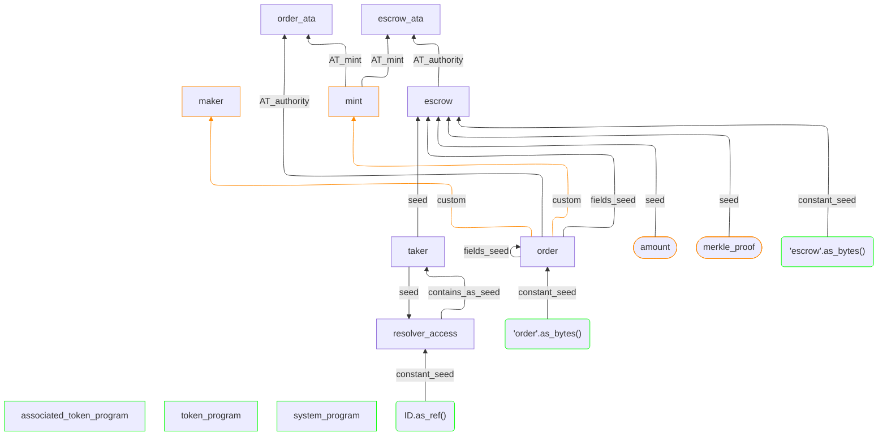

# Anchor Constraints Analyzer

This tool analyzes security of constraints in Solana programs written with Anchor. The main idea is to make sure that all accounts in constraints are "defined" by something. In addition, it writes the Mermaid graph, which allows to visualize connections between all constraints.

**Note** that this doesn't mean that constraints do not have bugs at all. It just performs a basic static analysis, which can be useful to find simple security bugs.

### How it works

The tool uses [tree-sitter](https://tree-sitter.github.io/tree-sitter/) to parse the source code. After parsing it looks for constraints structures, converts them into custom Python types and analyzes each account inside the structures. There still may be some issues, since not all Anchor constraints processing was implemented yet.

### The idea of "definitions"

Consider the following simple example:

```rust
#[derive(Accounts)]
pub struct UpdateConfig<'info> {
    #[account(mut)]
    pub authority: Signer<'info>,

    #[account(
        mut,
        seeds = [b"config", authority.key().as_ref()],
        bump
    )]
    pub config: Account<'info, Config>,
}
```

The idea is to check the definition of each account - `authority` and `config` in this case. It means that each account should have a minimum number of correct checks. The `config` account doesn't have `init` or `init_if_needed` constraints, which means that it should be already initialized before via the program and here is used also to verify the `authority` account via its seeds. This means that the `authority` account is defined via `config`'s seeds. The `config` account is considered defined using its seeds by default.

Now the next example:

```rust
#[account(
    mut,
    seeds = [
        b"order",
        maker.key().as_ref(),
        taker.key().as_ref(),
        nonce.to_le_bytes().as_ref()
    ],
    bump
)]
pub order: Account<'info, Order>,

#[account(
    constraint = mint.key() == order.token_mint @ ErrorCode::InvalidMint
)]
pub mint: Account<'info, Mint>,

#[account(
    mut,
    associated_token::mint = mint,
    associated_token::authority = order,
    associated_token::token_program = token_program
)]
pub order_ata: Account<'info, TokenAccount>,
```

Here are 3 accounts `order`, `mint` and `order_ata`. The `order` account is considered defined via its seeds by default, `mint` account is defined by the `token_mint` field of the `order` account using a custom constraint, and the `order_ata` account is defined by 2 required constraints - mint and authority (`order`).

In case some accounts are not defined by anything, it may be the first place to look for bugs of missing checks. 

Of course, in this way we do not look at checks inside an instruction processing function and do not analyze accounts in depth, which may yield false-positives or sometimes true-negatives. However, it may help to find simple bugs to save time, especially on a large codebase.

### Graphs

The script allows also to write a Mermaid graph to visualize accounts, constants and instruction arguments connections. This makes it easier to understand all the relations between accounts. Below is the example for the `CreateEscrow` constraints graph from the 1inch cross-chain protocol ([link](https://github.com/1inch/solana-crosschain-protocol/blob/58b8a428f24302ea9e36c31336e36f9c20a696fa/programs/cross-chain-escrow-src/src/lib.rs#L677)):



For example, we see that the `order` account is defined by the `'order'` constant (`constant_seed` relation) and its own fields (`fields_seed`), since the account should already be initialized. The `order_ata` is defined by the `mint` and the `order` accounts.

**Green** boxes are constants or default system accounts. **Yellow** are accounts, connections or instruction arguments, which should be checked manually. **Red** boxes highlight accounts that aren't defined by anything and potentially may cause problems.

### How to run

```bash
pip3 install -r requirements.txt
python3 run.py [-q] <source code file or directory> [<output MD file with graphs>]
```
